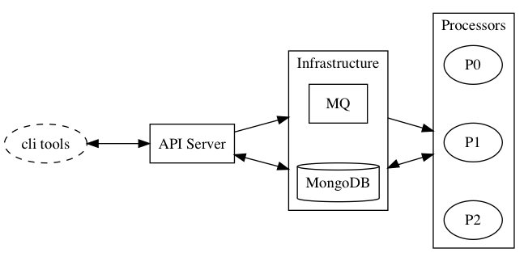
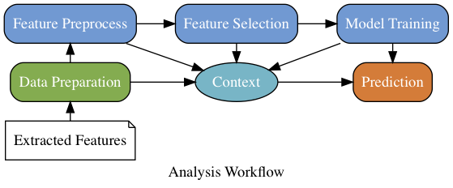

# Analysis Platform

Analysis Platform is a research platform that analysis data.

### Platform Architecure

### Analysis Workflow

|     Processor      |             Phase            |
|--------------------|:----------------------------:|
| Data Preparation   | Data Clean & Preprocessing   |
| Feature Preprocess | Feature Engineering          |
| Feature Selection  | Feature Engineering          |
| Model Training     | Training & Cross Validataion |
| Prediction         | Prediction & Testing         |

#### Action Items

* Data Preparation
    * Load Feature + Label
    * Clean Data
    * Split data into train / test set(default: 80%, 20%)
* Feature Processes
    * Imputation (output: `imputer`)
    * Normalization (output: `normalizer`)
    * Feature histogram and boxplot
* Feature Selection
    * Correlation Analysis (output: `correlator`)
    * PCA (output: `dim_reducer`)
    * Select from statistical analysis or models (output: `selector`)
        * ANOVA, Mutual Information, Mann Whitney U Test
        * Random Forest
        * Lasso CV
        * Logistic Regression CV
* Model Training
    * Model
        * Logistic Regression
        * SVC, LSVC
        * Lasso
        * Random Forest
        * Adaboost
        * GBM
    * N-fold cross validataion
    * Grid Search for hyperparameters
    * Feature Importance
* Prediction
    * Transform Pipeline on Test set
    * Prediction on Test set
    * Model Evaluation by ROC curve, confusion matrix, classification report
